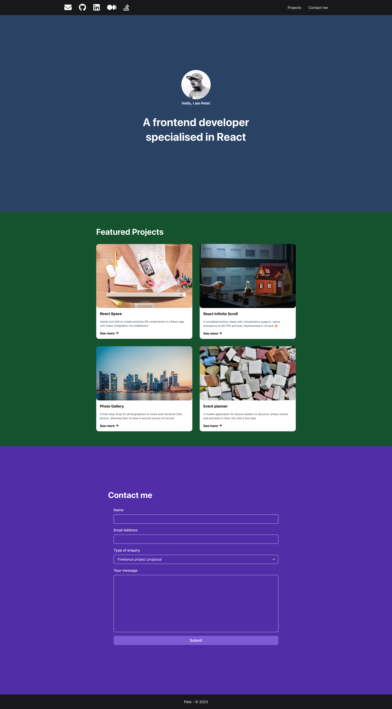

# React Portfolio App

This is Simple single-page application made with React using Chakra UI, Formik and Yup libraries.

## How to run this project?

1. You must have Node.js and npm installed. In case you don't have them, here is the link to the [installation guide](https://docs.npmjs.com/downloading-and-installing-node-js-and-npm).
2. Go to project directory in your terminal and run: ```npm install```
3. Run the app in the developement mode using command: `npm start`

## Related documentation
- React [documentation](https://react.dev)
- Chakara UI [documentation](https://chakra-ui.com/docs/components)
- Formik [documentation](https://formik.org/docs/overview)
- Yup [GitHub](https://github.com/jquense/yup)

## App screenshot



